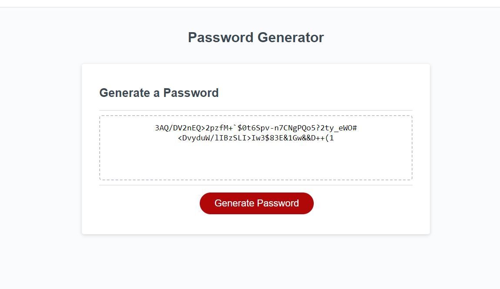

# <Random-Password-Generator>

## Description

Provide a short description explaining the what, why, and how of your project. Use the following questions as a guide:
There are many services out there on the internet now. And if you want to use many of them, you need a password. But, eventually you run out of ideas for passwords that are safe. So, this application is meant to allow users to quickly generate a new, very tough to crack, password of their own. This project allowed me to review both my usage of functions as well as implementing the random number function which are both used frequently in all kind of applications.

## Usage

In order to generate your new random password, simply click the "Generate Password" button and follow the prompts. Once you complete the prompts, your password will be automatically generated.

## Link